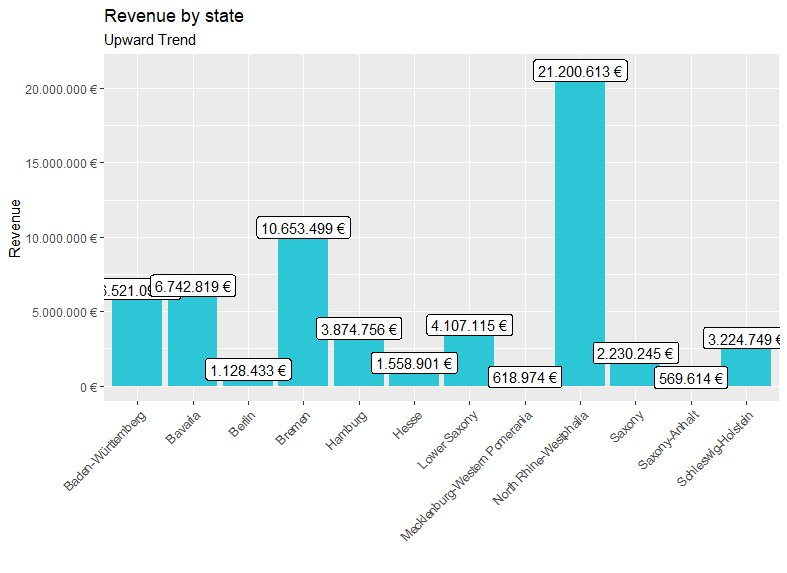
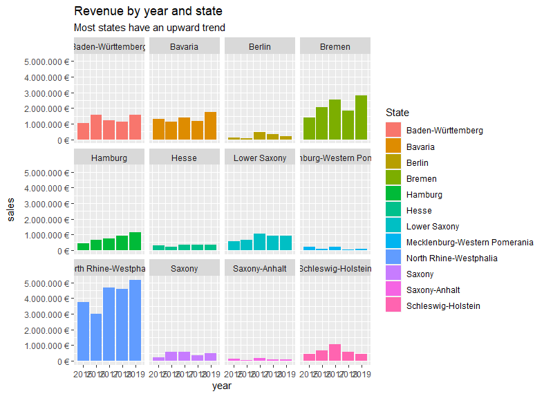
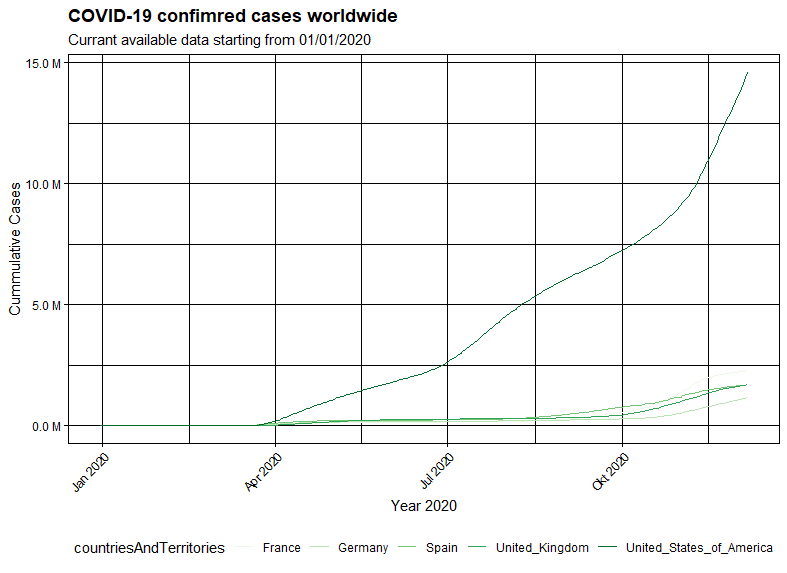

```{r setup, include=FALSE}
knitr::opts_chunk$set(message=FALSE,warning=FALSE, cache=TRUE)
```

# Chapter 00

- Password protected site is online
- Many programs and dependencies are installed 

# Chapter 01
## Code
```{r Code01, eval=FALSE}
# Data Science at TUHH ------------------------------------------------------
# SALES ANALYSIS ----

# 1.0 Load libraries ----

library(tidyverse)
#  library(tibble)    --> is a modern re-imagining of the data frame
#  library(readr)     --> provides a fast and friendly way to read rectangular data like csv
#  library(dplyr)     --> provides a grammar of data manipulation
#  library(magrittr)  --> offers a set of operators which make your code more readable (pipe operator)
#  library(tidyr)     --> provides a set of functions that help you get to tidy data
#  library(stringr)   --> provides a cohesive set of functions designed to make working with strings as easy as possible
#  library(ggplot2)   --> graphics

# Excel Files
library(readxl)
library(lubridate)
library(writexl)


# 2.0 Importing Files ----

bike_orderlines_joined_tbl <- readRDS("00_data/01_bike_sales/02_wrangled_data/bike_orderlines.rds")

bike_orderlines_joined_tbl %>% glimpse()

# 3.0 Wrangling Data ----

# separate location into city and state
bike_location_wrangled_tbl <- bike_orderlines_wrangled_tbl %>%
  # 5.1 Separate category name
  separate(col    = location,
           into   = c("city", "state"),
           sep    = ", ")
  
  
  # 5.2 Show unique cities and states
  bike_location_wrangled_tbl %>% 
    select("city", "state") %>%
    unique()

# 6.0 Business Insights ----
# 6.1 Sales by Year ----

# Step 1 - Manipulate

sales_by_state_tbl <- bike_location_wrangled_tbl %>%
  
  # Select columns
  select(state, total_price) %>%
  
  # Grouping by state and summarizing sales
  group_by(state) %>% 
  summarize(sales = sum(total_price)) %>%
  
  # Optional: Add a column that turns the numbers into a currency format 
  # (makes it in the plot optically more appealing)
  # mutate(sales_text = scales::dollar(sales)) <- Works for dollar values
  mutate(sales_text = scales::dollar(sales, big.mark = ".", 
                                     decimal.mark = ",", 
                                     prefix = "", 
                                     suffix = " €"))

sales_by_state_tbl

# Step 2 - Visualize

sales_by_state_tbl %>%
  
  # Setup canvas with the columns state (x-axis) and sales (y-axis)
  ggplot(aes(x = state, y = sales)) +
  
  # Geometries
  geom_col(fill = "#2DC6D6") + # Use geom_col for a bar plot
  geom_label(aes(label = sales_text)) + # Adding labels to the bars
  
  
  # Formatting
  # scale_y_continuous(labels = scales::dollar) + # Change the y-axis. 
  # Again, we have to adjust it for euro values
  scale_y_continuous(labels = scales::dollar_format(big.mark = ".", 
                                                    decimal.mark = ",", 
                                                    prefix = "", 
                                                    suffix = " €")) +
  labs(
    title    = "Revenue by state",
    subtitle = "Upward Trend",
    x = "", # Override defaults for x and y
    y = "Revenue"
  ) +
  # vertical description

  theme(axis.text.x = element_text(angle = 45, hjust = 1))


# 6.2 Sales by Year and State ----

# Step 1 - Manipulate

sales_by_year_state_tbl <- bike_location_wrangled_tbl %>%
  
  # Select columns and add a year
  select(order_date, total_price, state) %>%
  mutate(year = year(order_date)) %>%
  
  # Group by and summarize year and state
  group_by(year, state) %>%
  summarise(sales = sum(total_price)) %>%
  ungroup() %>%
  
  # Format $ Text
  mutate(sales_text = scales::dollar(sales, big.mark = ".", 
                                     decimal.mark = ",", 
                                     prefix = "", 
                                     suffix = " €"))

sales_by_year_state_tbl  

# Step 2 - Visualize

sales_by_year_state_tbl %>%
  
  # Set up x, y, fill
  ggplot(aes(x = year, y = sales, fill = state)) +
  
  # Geometries
  geom_col() + # Run up to here to get a stacked bar plot
  
  # Facet
  facet_wrap(~ state) +
  
  # Formatting
  scale_y_continuous(labels = scales::dollar_format(big.mark = ".", 
                                                    decimal.mark = ",", 
                                                    prefix = "", 
                                                    suffix = " €")) +
  labs(
    title = "Revenue by year and state",
    subtitle = "Most states have an upward trend",
    fill = "State" # Changes the legend name
  )


# 7.0 Writing Files ----

# 7.1 Excel ----
bike_location_wrangled_tbl %>%
  write_xlsx("00_data/01_bike_sales/02_wrangled_data/bike_location.xlsx")

# 7.2 CSV ----
bike_location_wrangled_tbl %>% 
  write_csv("00_data/01_bike_sales/02_wrangled_data/bike_location.csv")

# 7.3 RDS ----
bike_location_wrangled_tbl %>% 
  write_rds("00_data/01_bike_sales/02_wrangled_data/bike_location.rds")


```
## Results
```{r results01, eval=TRUE}
library(readr)
sales_by_year_state_tbl <-  read_rds("journal_files/output01.rds")
sales_by_year_state_tbl
```




End of chapter 1

# Chapter 02

## Code Part 1 
```{r Code02_1, eval=FALSE}
library(httr)
library(glue)
library(lubridate)
library(purrr)
library(xopen)
library(tidyverse)

rover <-  "curiosity"
date <- today() - weeks(1)


# Wrapped into a function
nas_api <- function(rover, date) {
  url <- modify_url(url = "https://api.nasa.gov", path = glue("/mars-photos/api/v1/rovers/{rover}/photos?earth_date={date}&api_key=DEMO_KEY"))
  resp <- GET(url)
  stop_for_status(resp) # automatically throws an error if a request did not succeed
}

response <- nas_api(rover, date)

nasa_tbl <- response %>% 
  # acsess content
  content() %>% 
  # convert to tibble
  as_tibble() %>% 
  # unnest
  unnest_wider(1) %>% 
  # unnestr further
  unnest_wider("camera",  names_repair = "unique") %>% 
  unnest_wider("rover", names_repair = "unique") %>%
  # rename
  rename("pic_id" = "id...1") %>% 
  rename("camera_id" = "id...3") %>%
  rename("camera_name" = "name...4") %>%
  rename("rover_name" = "name...10") %>%
  # drop column with rover id duplicate
  select(-"id...9") 

  pic_selected <- nasa_tbl %>% 
    slice_sample(n = 1) %>% 
    glimpse() %>% 
    pluck("img_src") %>% 
    xopen()

```
## Results
```{r results02_1, eval=TRUE}
library(readr)
nasa_tbl <- read_rds("journal_files/output02.rds")
nasa_tbl
```


## Code Part 2 
```{r Code02_2, eval=FALSE}

# WEBSCRAPING ----

# 1.0 LIBRARIES ----

library(tidyverse) # Main Package - Loads dplyr, purrr, etc.
library(rvest)     # HTML Hacking & Web Scraping
library(xopen)     # Quickly opening URLs
library(jsonlite)  # converts JSON files to R objects
library(glue)      # concatenate strings
library(stringi)   # character string/text processing

# 1.1 COLLECT PRODUCT FAMILIES ----

url_home          <- "https://www.radon-bikes.de/en/"
#xopen(url_home) # Open links directly from RStudio to inspect them

# Read in the HTML for the entire webpage
html_home         <- read_html(url_home)

# Web scrape the urls for the families
bike_family_tbl <- html_home %>%
  
  # Get the nodes for the families ...
  html_nodes(css = ".has-dropdown.js-dropdown") %>%
  html_nodes(css = ".megamenu__item") %>% 
  html_nodes(css = "*[href]") %>% 
  
  # ...and extract the information of the href attribute
  html_attr("href") %>%
  
  # Remove the product families wear
  discard(.p = ~stringr::str_detect(.x,"wear")) %>%
  
  # Convert vector to tibble
  enframe(name = "position", value = "family_url") %>%
  
  # 
  mutate(
    family_url = glue("https://www.radon-bikes.de{family_url}bikegrid/")
  ) %>% 

  # get product categories and subcategories
  mutate(
    category01 = stringr::str_extract_all(family_url, "([^/]+)")) %>% 
  # drop unused url parts
  unnest_wider(category01) %>% 
  select(-...1, -...2, -...3) %>% 
  # rename
  rename(category01 = ...4) %>% 
  rename(category02 = ...5) %>% 
  
  glimpse()


# 2.0 COLLECT BIKE DATA ----
  
  
# 2.2 Wrap it into a function ----
get_bike_data <- function(url, bike_cat01, bike_cat02) {
  html_bike_category <- read_html(url)
  
  # Get the URLs
  bike_url_tbl  <- html_bike_category %>%
    html_nodes(css = ".row.m-bikegrid__info > a") %>%
    html_attr("href") %>%
    enframe(name = "position", value = "url") %>%
    mutate(
      url = glue("https://www.radon-bikes.de{url}")
    )
  
  # Get names
  bike_name_tbl <- html_bike_category %>%
    html_nodes(css = '.row.m-bikegrid__info > a > .columns.small-12 > h4') %>%
    html_text() %>%
    enframe(name = "position", value = "name") %>% 
    # delete whitespace
    mutate(
      name = stringr::str_extract(name, "(\\S+.*\\S+)")
    )
  
  # Get price
  bike_price_tbl <- html_bike_category %>%
    html_nodes(css = '.row.m-bikegrid__info > a > .columns.small-12 > .m-bikegrid__price.currency_eur > .m-bikegrid__price--active') %>%
    html_text() %>%
    enframe(name = "position", value = "price")
  
  # join tables
  bikes_tbl <- bike_url_tbl %>% 
    left_join(bike_name_tbl) %>%
    left_join(bike_price_tbl)
  
  # add categories
  bikes_tbl <-  bikes_tbl %>% add_column(category01 = bike_cat01) %>% 
    add_column(category02 = bike_cat02)
    
    
  
}

# Run the function with the first url to check if it is working
# bike_url <- bike_family_tbl$family_url[1]
# bike_cat1 <- bike_family_tbl$category01[1]
# bike_cat2 <- bike_family_tbl$category02[1]
# bike_data_tbl     <- get_bike_data(url = bike_url, bike_cat01 = bike_cat1, bike_cat02 = bike_cat2)
# 
# bike_data_tbl

# 2.3.1a Map the function against all urls

# Extract the urls as a character vector
bike_url <- bike_family_tbl$family_url
bike_cat1 <- bike_family_tbl$category01
bike_cat2 <- bike_family_tbl$category02

# Run the function with every url as an argument
bike_data_lst <- pmap(list(bike_url, bike_cat1, bike_cat2), get_bike_data)

# Merge the list into a tibble
bike_data_tbl <- bind_rows(bike_data_lst)

# combine with categories

saveRDS(bike_data_tbl, "bike_data_tbl.rds")


```
## Results
```{r results02_2, eval=TRUE}
library(readr)
bike_data_tbl <- read_rds("journal_files/output02_2.rds")
bike_data_tbl
```

# Chapter 03
I used the reduced data set due to long download time of full data set
## Code Part 1 
```{r Code03_1, eval=FALSE}
# 1.0 Libraries ----
# Tidyverse
library(tidyverse)
library(vroom)

# Data Table
library(data.table)

# 2.0 DATA IMPORT ----
col_types <- list(
  id = col_character(),
  type = col_character(),
  number = col_character(),
  country = col_character(),
  date = col_date("%Y-%m-%d"),
  abstract = col_character(),
  title = col_character(),
  kind = col_character(),
  num_claims = col_double(),
  filename = col_character(),
  withdrawn = col_double()
)

patent_tbl <- vroom(
  file       = "00_data/04_Patent_data_reduced/patent.tsv", 
  delim      = "\t", 
  col_types  = col_types,
  na         = c("", "NA", "NULL")
)

patent_tbl %>% glimpse()

assignee_tbl <- vroom(
  file       = "00_data/04_Patent_data_reduced/assignee.tsv", 
  delim      = "\t", 
  col_types  = col_types,
  na         = c("", "NA", "NULL")
)

assignee_tbl %>% glimpse()

patent_assignee_tbl <- vroom(
  file       = "00_data/04_Patent_data_reduced/patent_assignee.tsv", 
  delim      = "\t", 
  col_types  = col_types,
  na         = c("", "NA", "NULL")
)

patent_assignee_tbl %>% glimpse()

# 3.1 assignee Data ----

setDT(assignee_tbl)

setDT(patent_assignee_tbl)

# 4.0 DATA WRANGLING ----

setnames(assignee_tbl, "id", "assignee_id")
combined_data <- merge(x = assignee_tbl, y = patent_assignee_tbl, 
                       by    = "assignee_id", 
                       all.x = FALSE, 
                       all.y = TRUE)

patents_com <- combined_data[type == 2,.N, by = .(assignee_id, organization)][order(-N)]

patents_com[1:10]
```

## Results
```{r results03_1, eval=TRUE}
library(readr)
patents_com <- read_rds("journal_files/output03_01.rds")
patents_com
```


## Code Part 2 
```{r Code03_2, eval=FALSE}
# 1.0 Libraries ----
# Tidyverse
library(tidyverse)
library(vroom)

# Data Table
library(data.table)

# 2.0 DATA IMPORT ----
col_types <- list(
  id = col_character(),
  type = col_character(),
  number = col_character(),
  country = col_character(),
  date = col_date("%Y-%m-%d"),
  abstract = col_character(),
  title = col_character(),
  kind = col_character(),
  num_claims = col_double(),
  filename = col_character(),
  withdrawn = col_double()
)

patent_tbl <- vroom(
  file       = "00_data/04_Patent_data_reduced/patent.tsv", 
  delim      = "\t", 
  col_types  = col_types,
  na         = c("", "NA", "NULL")
)

patent_tbl %>% glimpse()

assignee_tbl <- vroom(
  file       = "00_data/04_Patent_data_reduced/assignee.tsv", 
  delim      = "\t", 
  col_types  = col_types,
  na         = c("", "NA", "NULL")
)

assignee_tbl %>% glimpse()

patent_assignee_tbl <- vroom(
  file       = "00_data/04_Patent_data_reduced/patent_assignee.tsv", 
  delim      = "\t", 
  col_types  = col_types,
  na         = c("", "NA", "NULL")
)

patent_assignee_tbl %>% glimpse()

# 3.1 assignee Data ----

setDT(assignee_tbl)

setDT(patent_assignee_tbl)

setDT(patent_tbl)

# 4.0 DATA WRANGLING ----

setnames(assignee_tbl, "id", "assignee_id")
setnames(patent_tbl, "id", "patent_id")

combined_data <- merge(x = assignee_tbl, y = patent_assignee_tbl, 
                       by    = "assignee_id", 
                       all.x = FALSE, 
                       all.y = TRUE)

combined_data <- merge(x = combined_data, y = patent_tbl, 
                       by    = "patent_id", 
                       all.x = FALSE, 
                       all.y = TRUE)


patents_com_2019 <- combined_data[type == 2 & lubridate::year(date) == "2019",.N, by = .(assignee_id, organization)][order(-N)]

patents_com_2019[1:10]

```
## Results
```{r results03_2, eval=TRUE}
library(readr)
patents_com_2019 <- read_rds("journal_files/output03_02.rds")
patents_com_2019
```

## Code Part 3 
I wasn`t able to solve this problem compeletly
```{r Code03_3, eval=FALSE}
# 1.0 Libraries ----
# Tidyverse
library(tidyverse)
library(vroom)

# Data Table
library(data.table)

# 2.0 DATA IMPORT ----
col_types <- list(
  id = col_character(),
  type = col_character(),
  number = col_character(),
  country = col_character(),
  date = col_date("%Y-%m-%d"),
  abstract = col_character(),
  title = col_character(),
  kind = col_character(),
  num_claims = col_double(),
  filename = col_character(),
  withdrawn = col_double()
)

patent_tbl <- vroom(
  file       = "00_data/04_Patent_data_reduced/patent.tsv", 
  delim      = "\t", 
  col_types  = col_types,
  na         = c("", "NA", "NULL")
)

patent_tbl %>% glimpse()

assignee_tbl <- vroom(
  file       = "00_data/04_Patent_data_reduced/assignee.tsv", 
  delim      = "\t", 
  col_types  = col_types,
  na         = c("", "NA", "NULL")
)

assignee_tbl %>% glimpse()

patent_assignee_tbl <- vroom(
  file       = "00_data/04_Patent_data_reduced/patent_assignee.tsv", 
  delim      = "\t", 
  col_types  = col_types,
  na         = c("", "NA", "NULL")
)

patent_assignee_tbl %>% glimpse()

uspc_tbl <- vroom(
  file       = "00_data/04_Patent_data_reduced/uspc.tsv", 
  delim      = "\t", 
  col_types  = col_types,
  na         = c("", "NA", "NULL")
)

uspc_tbl %>% glimpse()

# 3.1 assignee Data ----

setDT(assignee_tbl)

setDT(patent_assignee_tbl)

setDT(uspc_tbl)

# 4.0 DATA WRANGLING ----

setnames(assignee_tbl, "id", "assignee_id")
uspc_tbl[, id_chr := as.character(patent_id)]
uspc_tbl[, patent_id:= NULL]
setnames(uspc_tbl, "id_chr", "patent_id")

combined_data <- merge(x = assignee_tbl, y = patent_assignee_tbl, 
                       by    = "assignee_id", 
                       all.x = FALSE, 
                       all.y = TRUE)

combined_data <- merge(x = combined_data, y = uspc_tbl, 
                       by    = "patent_id", 
                       all.x = TRUE, 
                       all.y = FALSE)

# 4.3 Select Columns ----
combined_data %>% dim()

keep_cols <- c()

combined_data <- combined_data[, ..keep_cols]

combined_data %>% dim()

combined_data %>% glimpse()


patents_class_world <- combined_data[type == 2 | type == 3,.N, by = .(mainclass_id)][order(-N)]

patents_class_world[1:10]


patents_class_world_top <- combined_data[type == 2 | type == 3,.N, by = .(assignee_id, organization, mainclass_id)][
  order(-N)][
    1:10, .(assignee_id, organization, mainclass_id)][
      ,.N, by = .(mainclass_id, organization)][
        order(-N)][
          1:10, .(mainclass_id, organization)]

patents_class_world_top

```

# Chapter 04
## Code Part 1 
```{r Code04_1, eval=FALSE}
library(tidyverse)
covid_data_tbl <- read_csv("https://opendata.ecdc.europa.eu/covid19/casedistribution/csv")

cases_cumul <- covid_data_tbl%>%
  select(dateRep, countriesAndTerritories, cases) %>% 
  filter(countriesAndTerritories == 'Germany' | 
           countriesAndTerritories == 'United_Kingdom' | 
           countriesAndTerritories == 'Spain' | 
           countriesAndTerritories == 'France' | 
           countriesAndTerritories == 'United_States_of_America') %>% 
  group_by(countriesAndTerritories) %>%
  mutate( dateRep = lubridate::dmy(dateRep)) %>% 
  arrange(dateRep) %>%
  mutate(case_sum = cumsum(cases)) %>% 
  ungroup()
  
cases_cumul %>% 
# Canvas
ggplot(aes(x = dateRep, y = case_sum, color = countriesAndTerritories)) +
  
  # Geoms
  geom_line(aes(x = dateRep, y = case_sum, color = countriesAndTerritories)) +
  
  
  scale_y_continuous(name = "Cummulative Cases",labels = scales::unit_format(unit = "M", scale = 1e-6)) +
  scale_x_date( name = "Year 2020",labels = scales::date_format("%b %Y")) +
  
  scale_color_brewer(palette = RColorBrewer::brewer.pal(n = 8, name = "Blues")[8]) +
  
  labs( title ="COVID-19 confimred cases worldwide",
        subtitle = "Currant available data starting from 01/01/2020") +
  
  theme_linedraw() +
  
  expand_limits(y = 0) +
  
  
  theme(
    axis.text.x = element_text(
      angle = 45,
      hjust = 1),
    
    legend.position = "bottom", 
    plot.title = element_text(face = "bold"),
    
    )
  
  
```

## Results
```{r results04_1, eval=TRUE}
library(readr)
cases_cumul <- read_rds("journal_files/output04_01.rds")
cases_cumul
```


## Code Part 2

I was overwhelmed with the thematic extent of this course and therefore unfortunately could not solve this part of the assignment.
